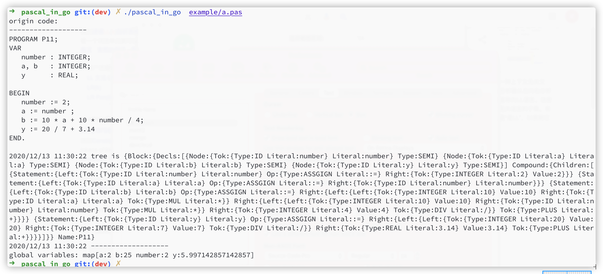

# pascal_in_go
implenment the sub-grammar of pascal with golang   


# Key Features
- program : PROGRAM Variable SEMI block DOT

- block : declarations compound_statement

- declarations :  VAR(variable_declaration SEMI)+  | empty

- variable_declaration : ID(COMMA ID)* COLON type_spec

- type_spec : INTEGER | REAL

- compound_statement :  BEGIN   statement_list  END

- statement_list : statement | statement SEMI  statement_list

- statement :  compound_statement | assignment  | empty

- assignment :  variable  ASSIGN expr

- expr : term ((PLUS |  MINUS) term )*

- term : factor ((MUL | INTEGER_DIV | FLOAT_DIV) factor )*

- factor :  PLUS factor
		| MINUS factor
		| REAL_CONST
		| INTEGER_CONST
		| Lparenthesized expr Rparenthesized
		| variable

- variable :  ID


# Quick start

```
    go build
    ./pascal_in_go  example/a.pas

```

- output:


# Motivation
> "What I cannot create I do not understand"
> -Richard Feyman

this project record my experience and every step  to learn how to build a interpreter or a compiler from scratch 
use BNF to define the grammar  and LL(k) parser with Recursive descent to implement the pascal 
